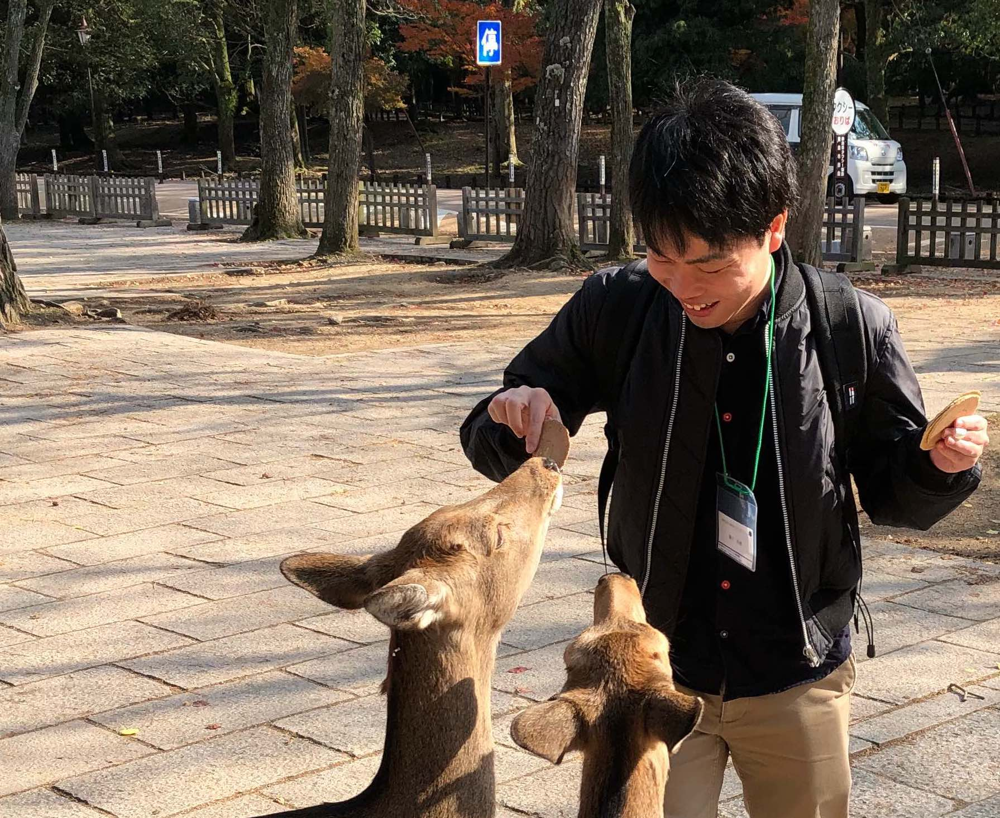
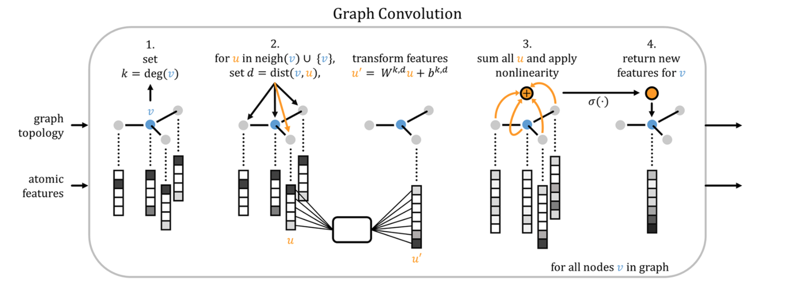

<!-- $size: 4:3 -->
<!-- page_number: true -->

# 深層学習を用いたsirtuin1脱アセチル化阻害化合物予測の試み
**チーム：G12 KUF**
**所属：非公開**

###### 第４回IT創薬コンテスト「コンピュータで薬のタネを創る４」発表会・表彰式
2017.12.15

---

# チームKUF

- ITエンジニア3名
    - Kubo
    - Uehara
    - Fujikawa

- 化合物向けの深層学習ライブラリの使い勝手や性能が気になり参加

---

# 手法紹介｜データ収集
- 使用データ
    - ChEMBLより、sirtuin1, 2, 3, 4, 5, 6, 7に対して計測された活性阻害実験データを収集（n=2,080）
    - BindingDBからも同じ条件でデータを収集（n=1,440）
    - 第三回コンテストのデータを追加 (n=3,192)
    - 重複（n=2,502）を削除
    - IC50が100 nM未満のものを **活性なし（n=4,127）** 、それ以外を **活性あり（n=74）** とラベル付けした

---

# 手法紹介｜学習と予測

- 学習
    - DeepChem[1]のGraph Convolution[2]を使用
    - 活性の有無を分類タスクとして解いた
- 予測
    - スコアの高いもの上位400化合物を提出
    - Train accuracy: 0.921、Valid accuracy: 0.717

<id style="font-size: 0.4em">[1]: [deepchem/deepchem: Democratizing Deep-Learning for Drug Discovery, Quantum Chemistry, Materials Science and Biology](https://github.com/deepchem/deepchem)
[2]: Altae-Tran, Han, et al. "Low Data Drug Discovery with One-Shot Learning." ACS central science 3.4 (2017): 283-293.</id> 

---

# GraphConvolutionについて
- 原子ごとにRDKitで結合情報、電荷などを求める
- 隣接する原子の情報を含めて画像解析で用いられる畳み込み（Convolution）により学習

> Altae-Tran, H. _et al._ (2017)

---

# DeepChemについて
- 化合物データを扱うための機械学習ライブラリ
- Python、TensorFlow、scikit-learnベース
- RFやSVMなどの機械学習手法のサンプルコード
- 種々のGraph Convolutionによるエンコーダーを用いた深層学習のサンプルコード
- シュレディンガー社の製品に組み込まれるなど注目されている

---

# 使用した計算環境について
全てクラウドで実行

|  | スペック |
| --- | --- |
| インスタンス | AWS EC2 p2.xlarge |
| GPU | 1 |
| CPU | 4 |
| RAM | 61 GiB |
| 価格 | 0.900 USD/h |
計算時間は**約5時間**、コストは**約500円**
**クラウド環境と創薬コンテストは抜群に相性がいい**